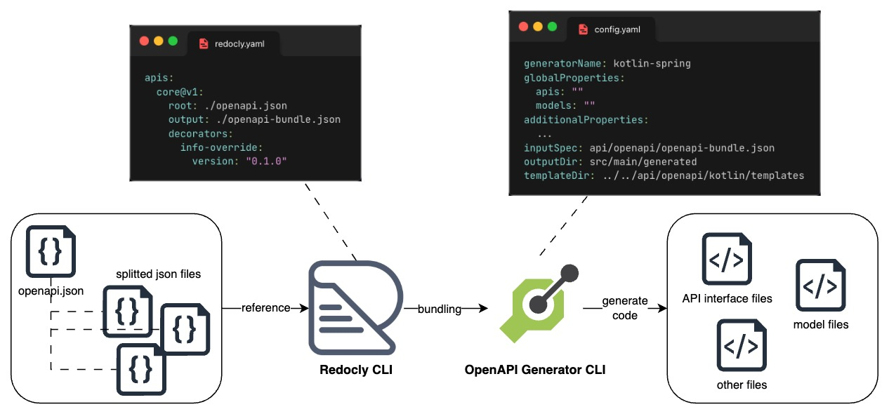

# Bookstore microservices

Bookstore microservices 프로젝트는 서점 서비스를 제공하는 마이크로서비스 기반의 샘플 백엔드 어플리케이션입니다. 시스템을 설계하고 벡엔드 API 구현과 인프라 구축에 대해 다루고 있습니다.

:warning: NOTE: 이 프로젝트는 진행 중입니다

- [시스템 설계](#시스템-설계)
- [주요 컨셉](#주요-컨셉)
- [어플리케이션 아키텍처](#어플리케이션-아키텍처)
  - [환경](#환경)
  - [마이크로서비스](#마이크로서비스)
  - [도메인 주도 설계](#도메인-주도-설계)
  - [포트 앤 어댑터 패턴 (헥사고날 아키텍처)](#포트-앤-어댑터-패턴-헥사고날-아키텍처)
  - [API-First 설계](#api-first-설계)
  - [오케스트레이션 사가 패턴](#오케스트레이션-사가-패턴)
- [CI/CD](#cicd)
  - [빌드](#빌드)
  - [배포](#배포)
- [인프라스트럭처](#인프라스트럭처)
  - [쿠버네티스](#쿠버네티스)
  - [Helm, Kustomize](#helm-kustomize)
  - [테라폼](#테라폼)
  - [보안](#보안)
- [참고](#참고)

## 시스템 설계


## 주요 컨셉

- 도메인 주도 설계
- 포트 앤 어댑터 패턴 (헥사고날 아키텍처)
- API-First 설계
- 마이크로서비스
- 쿠버네티스 기반

## 어플리케이션 아키텍처

### 환경

- Golang: Gin, Gorm
- Kotlin/Java: Spring Web MVC, Spring Data JPA

### 마이크로서비스

서비스는 서로 다른 언어와 프레임워크로 분리되어 개발하고 독립적으로 배포될 수 있습니다.

- catalog (상품)
- customer (고객)
- identity (인증)
- inventory (재고)
- order (주문)
- payment (결제)

### 도메인 주도 설계

도메인 주도 설계(Domain-Driven Design) 방식으로 접근하면 비즈니스 도메인을 파악하고 요구사항과 문제를 보다 효과적으로 해결할 수 있습니다. 핵심 도메인과 다른 도메인들을 식별하고 의사결정을 내리는 데 도움이 됩니다.

도메인 주도 설계를 위해 도메인을 식별하고 그에 대한 동작, 이벤트, 상태들을 정의합니다. 정의한 리소스들을 바탕으로 바운디드 컨텍스트를 설계하며, 필요에 따라 크기를 결정하게 됩니다. 먼저 동작/액션들을 타임라인(처리 순서의 흐름)에 따라 나열하고, 상위/하위 도메인을 식별하여 구분합니다. 그리고 나서 담당자 및 시스템 별로 그룹화 하여 컨텍스트들을 설계합니다.

구현 레벨에서는 도메인 모델을 기반으로 애그리거트와 엔터티를 정의하고 비즈니스 로직을 구현하여 실행합니다. 바운디드 컨텍스트 사이의 간단한 컨트랙트는 gRPC로 연동하여 상호작용이 이루어지고, 여러 컨텍스트에 걸친 비즈니스 플로우는 오케스트레이션 사가 패턴을 적용하며 Conductor 워크플로우를 통해 관리합니다.

### 포트 앤 어댑터 패턴 (헥사고날 아키텍처)


포트 앤 어댑터 패턴(Ports and Adapters Pattern)을 적용하여 어플리케이션의 비즈니스 로직과 외부 시스템 연결 간의 코드 결합을 줄이고 유연성을 높입니다. 어플리케이션은 포트, 어댑터, 도메인으로 나누어 구성됩니다. 포트는 어플리케이션 진입점에 대한 인터페이스를 정의하고, 이를 구현하는 어댑터는 외부 시스템과의 상호작용을 처리합니다:

- openapi 인터페이스 포트 --> REST API 컨트롤러 어댑터
- repo 인터페이스 포트 --> MySQL 리포지토리 어댑터
- pb 인터페이스 포트 --> gRPC 클라이언트/서버 어댑터
- idp 인터페이스 포트 --> Keycloak API 클라이언트 어댑터

그리고 어플리케이션의 비즈니스 로직의 인터페이스인 유스케이스를 정의하고 서비스 구현체를 만듭니다:

- 유스케이스 --> 서비스(구현체)
- 핸들러(도메인 로직) --> 핸들러(구현체)

어댑터에서는 유스케이스 또는 핸들러를 호출하여 도메인 모델과 연결됩니다. 각 어플리케이션은 다음과 같이 4단계 또는 3단계 계층 구조로 구성됩니다. 유스케이스는 핸들러 로직들의 조합을 간략히 하는 파사드 패턴입니다:

- 4단계 계층: 프레젠테이션(API) -- 유스케이스(비즈니스 로직) -- 핸들러(도메인 로직) -- 데이터 액세스(리포지토리)
- 3단계 계층: 프레젠테이션(API) -- 핸들러(도메인 로직) -- 데이터 액세스(리포지토리)

프로젝트에서 클라이언트 요청 처리에 대해서는 REST API, 내부 서비스 간의 연동은 gRPC를 사용합니다.

어플리케이션 디렉터리 구조:

```txt
<service>
├── application
│   ├── port
│   │   ├── openapi // openapi 포트
│   │   ├── pb      // gRPC 포트
│   │   └── repo    // 리포지토리 포트
│   └── usecase     // 유스케이스
├── config
│   └── properties
├── domain
│   ├── aggregate   // 애그리거트
│   │   └── entity  // 엔터티
│   ├── constant
│   ├── handler     // 핸들러
│   ├── model       // 내부 모델
│   └── service     // 도메인 서비스
└── infrastructure
    ├── adapter
    │   ├── conductor   // Conductor 워커
    │   ├── mysql       // MySQL 리포지토리
    │   ├── protostub   // gRPC 클라이언트 스텁
    │   ├── protosvc    // gRPC 서버 서비스
    │   └── web         // REST API 컨트롤러
    └── support
```

### API-First 설계

API를 먼저 설계하고 나서 코드를 구현하는 API-First 접근 방식은 클라이언트와 서버 간의 계약이 명확해지고 지원여부나 제약조건 등과 관련하여 일관성을 가지게 되어 코드의 품질을 높일 수 있습니다. 또한 엔지니어 간의 협업을 원활하게 하며, 병렬적으로 개발을 진행할 수 있습니다.

**OpenAPI**

OpenAPI 스펙으로 REST API를 설계하고 OpenAPI Generator로 포트 인터페이스와 DTO 클래스/구조체를 생성합니다. 설계한 스펙(명세)는 효율적인 관리를 위해 경로(path) 별로 파일을 나누고, redocly 도구로 번들링하여(하나의 파일로 만들어) 사용합니다. OpenAPI Generator 도구를 사용하여 API 스펙을 바탕으로 프로젝트 내부와 외부 시스템(IDP)의 인터페이스 및 DTO들을 생성하게 되며, 코드 생성에는 커스텀 템플릿을 사용합니다.



OpenAPI 루트 디렉터리 구조:

```txt
api
└── idp                           // 외부 IDP(Keycloak) API
    ├── config-<...>-all.yaml     // API 인터페이스, 모델 DTO 등에 대한 구성
    ├── config-<...>-params.yaml  // 파라미터 DTO에 대한 구성
    ├── ...
    └── templates                 // 커스텀 템플릿 디렉터리
```

```txt
api
└── openapi                     // 어플리케이션 OpenAPI
    ├── golang
    │   ├── config-all.yaml     // API 인터페이스, 모델 DTO 등에 대한 구성
    │   ├── config-params.yaml  // 파라미터 DTO 대한 구성
    │   └── templates           // 커스텀 템플릿 디렉터리
    └── kotlin
        ├── config-all-reactive.yaml  // API 인터페이스, 모델 DTO 등에 대한 구성
        ├── config-all.yaml           // API 인터페이스, 모델 DTO 등에 대한 구성
        ├── config-params.yaml        // 파라미터 DTO에 대한 구성
        └── templates                 // 커스텀 템플릿 디렉터리
```

각 서비스 OpenAPI 스펙 디렉터리 구조:

```txt
api
└── openapi                 // 어플리케이션 OpenAPI 스펙
    ├── openapi.json        // API 스펙
    ├── paths               // path 별로 분할된 스펙 디렉터리
    │   ├── ...
    │   └── api_v1_customers.json
    └── redocly.yaml        // redocly 구성
```

**gRPC**

프로토콜 버퍼 정의(IDL)로 메시지와 서비스를 proto 파일로 작성하고 클라이언트 스텁과 서버 서비스 코드를 생성합니다. 생성된 코드로 부터 클라이언트와 서버 로직을 구현합니다. REST API에 비해 통신할 때 부피가 작고 에러가 쉽게 발생되지 않으며 여러 모드에서 작동할 수 있습니다. 스펙을 작성할 때는 버전 번호로 패키지 이름을 정의해서 확장성을 고려하며, 코드 생성 및 관리를 위해서 buf 도구를 사용합니다.


proto 디렉터리 구조:

```txt
proto
├── buf.gen.<module>.yaml   // buf 코드 생성 구성
├── buf.yaml                // buf 워크스페이스 정의 구성
└── modules                 // 모듈 디렉터리
    ├── ...
    ├── stock               // stock 모듈
    │   └── v1
    └── user                // user 모듈
        └── v1
```

### 오케스트레이션 사가 패턴

분산 트랜잭션 관리를 위해 적용되며, 중앙 코디네이터인 Conductor OSS에서 워크플로우를 관리합니다. 워크플로우에 정의되어 있는 흐름에 따라 여러 서비스에 걸친 각 단계를 실행하고 결과를 수신하여 다음 단계로 진행합니다. 코드에서 특정 비즈니스 로직이 호출되면 사가 워크플로우가 시작되며, 단계는 워크플로우에 대한 워커에서 태스크로 실행됩니다. 실행한 태스크가 실패하면 보상 로직이 트리거됩니다.<br>
Conductor는 태스크를 스케줄링하고 진행 상황 추적과 상태 관리를 담당하며, 서비스에서 워커는 Conductor 태스크를 폴링하고 작업을 수행한 뒤에 결과를 리턴합니다.

워크플로우:

```txt
place_order(주문) -> make_payment(결제) -> change_order_status(주문 상태 변경) -> reserve_inventory(재고 예약)
```

## CI/CD

Tekton과 ArgoCD를 사용하여 GitOps 패턴의 CI/CD 파이프라인을 구축합니다.


### 빌드

Tekton으로 CI/CD 파이프라인을 선언하고 실행합니다. Tekton은 쿠버네티스 네이티브 기반에서 동작하며 태스크와 파이프라인 정의를 재사용할 수 있고 클라우드 프로바이더에 종속되지 않습니다. 카탈로그는 파이프라인과 태스크 정의들이 선언된 Git 리포지토리로, 리소스들은 파이프라인 실행에서 재사용됩니다. 태스크는 파이프라인에서 실행되는 단위이며 파드로 독립적으로 실행됩니다.<br>
파이프라인은 GitOps 패턴을 적용하여 작성되며 소스 리포지토리에서 코드를 가져와 빌드하고 컨테이너 이미지를 레지스트리에 업로드합니다. 이후에 배포 리포지토리에서 매니페스트를 업데이트하고 ArgoCD로 애플리케이션을 배포합니다.

카탈로그 디렉터리 구조:

```txt
catalog
├── argocd-update-app   // 태스크
│   └── 0.1
├── golang-pipeline     // 파이프라인
│   └── 0.1
├── kotlin-pipeline     // 파이프라인
│   └── 0.1
└── make                // 태스크
    └── 0.1
```

파이프라인 태스크(task) 순서:

```txt
spec:
  description: |
    tasks:
      - clone-source-repo (git-clone)         // 소스 리포지토리 다운로드
      - build-app (make)                      // 어플리케이션 빌드
      - build-image (kaniko)                  // 컨테이너 이미지 빌드 및 푸시
      - clone-deploy-repo (git-clone)         // 배포 리포지토리 다운로드
      - update-values (yq)                    // Helm 차트 정의 업데이트
      - commit-deploy-repo (git-cli)          // 배포 리포지토리 업데이트 커밋
      - update-app (argocd-update-app)        // ArgoCD 어플리케이션 정의 업데이트
      - sync-app (argocd-task-sync-and-wait)  // ArgoCD 어플리케이션 동기화
```

### 배포

ArgoCD로 Kubernetes 클러스터에 어플리케이션을 배포합니다. ArgoCD는 선언적으로 어플리케이션을 관리합니다. Helm 차트로 작성한 어플리케이션 매니페스트는 Git 리포지토리에 저장되며, ArgoCD에 어플리케이션으로 등록하고 Kubernetes 클러스터로 원하는 상태(desired state)를 동기화하여 배포합니다.

## 인프라스트럭처

### 쿠버네티스

Kubernetes 클러스터에 인프라 서비스 및 어플리케이션을 배포합니다. 로컬 개발 편의를 위해 minikube로 단일 노드 클러스터를 구축합니다.

### Helm, Kustomize

인프라 서비스(서버)는 대부분 Helm 차트로 배포하고 있으며 일부는 Kustomize로 배포됩니다. 어플리케이션 서비스는 모두 Helm 차트로 작성되어 배포됩니다.

### 테라폼

인프라 구축에 대한 리소스는 Terraform으로 작성하고 관리합니다.

### 보안

- Keycloak의 OpenID Connect를 활용하며, Istio를 통해 요청에 대한 인증(request authentication)을 수행합니다.
- cert-manager로 HTTPS 통신을 위한 인증서를 발급하고 관리합니다.
- HashiCorp Vault로 어플리케이션과 인프라의 시크릿 정보를 관리하며 파드에 주입(secret injection)되어 사용됩니다.

## 참고

- Building Microservices, 2E (O'Reilly) | 마이크로서비스 아키텍처 구축
- Microservices Patterns (Manning) | 마이크로서비스 패턴
- Building Event-Driven Microservices (O'Reilly) | 이벤트 기반 마이크로서비스 구축
- Learning Domain-Driven Design (O'Reilly) | 도메인 주도 설계 첫걸음
- Automating API Delivery (Manning)
- gRPC: Up and Running (O'Reilly) | gRPC 시작에서 운영까지
- Kubernetes in Action (Manning) | 쿠버네티스 인 액션
- Istio in Action (Manning) | Istio in Action
- Kafka: The Definitive Guide, 2E (O'Reilly) | 카프카 핵심 가이드
