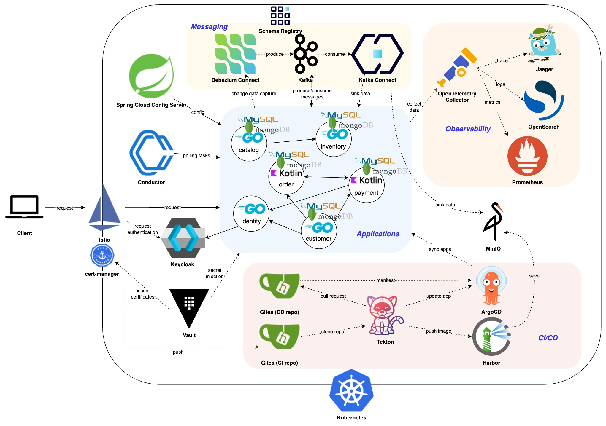

# Bookstore microservices

Bookstore microservices 프로젝트는 서점 서비스에 대한 마이크로서비스 기반 샘플 백엔드 어플리케이션입니다.

:warning: NOTE: 이 프로젝트는 진행 중입니다

- [시스템 설계](#시스템-설계)
- [서비스](#서비스)
- [주요 컨셉](#주요-컨셉)
- [어플리케이션 아키텍처](#어플리케이션-아키텍처)
  - [환경](#환경)
  - [메인 주도 설계](#메인-주도-설계)
  - [Ports and Adapters (Hexagonal) 아키텍처](#ports-and-adapters-hexagonal-아키텍처)
  - [API-First 설계](#api-first-설계)
  - [마이크로서비스](#마이크로서비스)
  - [오케스트레이션 사가 패턴](#오케스트레이션-사가-패턴)
- [보안](#보안)
- [CI/CD](#cicd)
  - [빌드](#빌드)
  - [배포](#배포)
- [인프라스트럭처](#인프라스트럭처)
  - [쿠버네티스](#쿠버네티스)
  - [Helm, Kustomize](#helm-kustomize)
  - [테라폼](#테라폼)

## 시스템 설계



## 서비스

- catalog (상품)
- customer (고객)
- identity (인증)
- inventory (재고)
- order (주문)
- payment (결제)

## 주요 컨셉

- 도메인 주도 설계
- Ports and Adapters (Hexagonal) 아키텍처
- API-First 설계
- 마이크로서비스
- 쿠버네티스 기반

## 어플리케이션 아키텍처

### 환경

- Golang: Gin, Gorm
- Kotlin: Spring Web MVC, Spring Data JPA

### 메인 주도 설계

애그리거트 및 엔터티를 기반으로 비즈니스 로직을 구현하고 실행합니다.

### Ports and Adapters (Hexagonal) 아키텍처

외부 시스템과의 연계를 포트(인터페이스)로 정의하고, 어댑터를 통해 연결합니다.

어플리케이션 디렉터리 구조:

```txt
<service>
├── application
│   ├── port        // 포트(인터페이스)
│   │   └── repo
│   └── usecase     // 유스케이스
├── config
│   └── properties
├── domain
│   ├── aggregate   // 애그리거트
│   │   └── entity  // 엔터티
│   ├── constant
│   ├── handler     // 핸들러
│   ├── model       // 내부 모델
│   └── service     // 도메인 서비스
└── infrastructure
    ├── adapter
    │   ├── conductor   // Conductor 워커
    │   ├── mysql       // MySQL 리포지토리
    │   ├── protostub   // gRPC 스텁
    │   ├── protosvc    // gRPC 서비스
    │   └── web         // REST API 컨트롤러
    └── support
```

### API-First 설계

API를 먼저 설계하고, 이를 기반으로 코드를 생성합니다.

**OpenAPI**

OpenAPI 스펙으로 API를 설계하고 OpenAPI Generator로 인터페이스와 DTO 클래스/구조체를 생성합니다. 코드 생성에 커스텀 템플릿이 사용됩니다.

디렉터리 구조:

```txt
idp                           // IDP(Keycloak) API
├── config-<...>-all.yaml     // API, 모델 DTO 등에 대한 구성
├── config-<...>-params.yaml  // 파라미터 DTO 대한 구성
├── ...
└── templates                 // 커스텀 템플릿 디렉터리


openapi                     // OpenAPI 스펙
├── golang
│   ├── config-all.yaml     // API, 모델 DTO 등에 대한 구성
│   ├── config-params.yaml  // 파라미터 DTO 대한 구성
│   └── templates           // 커스텀 템플릿 디렉터리
└── kotlin
    ├── config-all-reactive.yaml  // API, 모델 DTO 등에 대한 구성
    ├── config-all.yaml           // API, 모델 DTO 등에 대한 구성
    ├── config-params.yaml        // 파라미터 DTO 대한 구성
    └── templates                 // 커스텀 템플릿 디렉터리
```

**gRPC**

proto 파일을 작성하고 buf로 코드를 생성합니다.

디렉터리 구조:

```txt
proto
├── buf.gen.<module>.yaml
├── buf.yaml
└── modules
    ├── ...
    ├── order
    │   └── v1
    ├── payment
    │   └── v1
    ├── stock
    │   └── v1
    └── user
        └── v1
```

### 마이크로서비스

서비스는 분리되어 독립적으로 배포되고, 서로 다른 언어와 프레임워크로 개발될 수 있습니다.

### 오케스트레이션 사가 패턴

트랜잭션 관리를 위해 적용되어, Conductor OSS로 워크플로우를 관리합니다.

워크플로우:

```txt
place_order(주문) -> make_payment(결제) -> change_order_status (주문 상태 변경) -> reserve_inventory (재고 예약)
```

## 보안

Keycloak으로 OpenID Connect를 활용하며, Istio를 통해 요청에 대한 인증을 수행합니다.

cert-manager로 HTTPS 통신을 위한 인증서를 발급하고 관리합니다.

## CI/CD

GitOps 패턴의 CI/CD 파이프라인 구축을 위해 Tekton을 사용합니다.

### 빌드

Tekton으로 CI/CD 파이프라인을 선언하고 실행합니다.

파이프라인 카탈로그 디렉터리 구조:

```txt
catalog
├── argocd-update-app
│   └── 0.1
├── golang-pipeline
│   └── 0.1
├── kotlin-pipeline
│   └── 0.1
└── make
    └── 0.1
```

파이프라인 태스크(task) 순서:

```txt
    tasks:
      - clone-source-repo (git-clone)
      - build-app (make)
      - build-image (kaniko)
      - clone-deploy-repo (git-clone)
      - update-values (yq)
      - commit-deploy-repo (git-cli)
      - update-app (argocd-update-app)
      - sync-app (argocd-task-sync-and-wait)
```

### 배포

ArgoCD로 Kubernetes 클러스터에 애플리케이션을 배포합니다.

## 인프라스트럭처

### 쿠버네티스

Kubernetes 클러스터에 인프라 서비스 및 애플리케이션을 배포합니다. 클러스터는 로컬 테스트 편의를 위해 minikube로 구축합니다.

### Helm, Kustomize

인프라 서비스들은 Helm 차트와 Kustomize로 배포됩니다.

### 테라폼

인프라 구축에 대한 리소스는 Terraform으로 작성하고 관리합니다.
